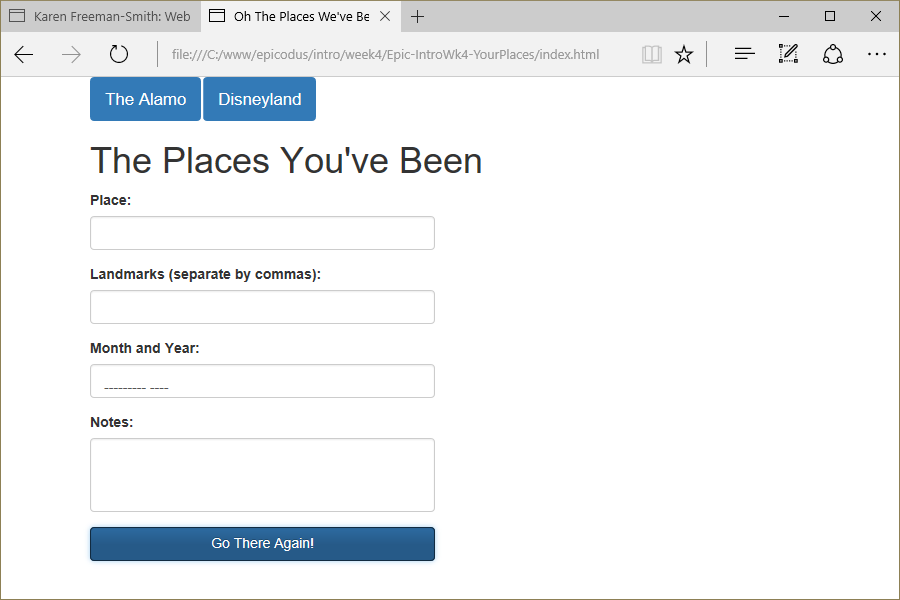

# Places We've Been
Version 0.0.1: August 22, 2016
by [Karen Freeman-Smith](https://karenfreemansmith.github.io) and [Ewa Manek](htps://github.com/ewajm)

### Technologies Used
HTML, CSS, Bootstrap, JavaScript, jQuery

## Description
*[Epicodus](http://epicodus.com) Intro to Programming Week 4 Pair Project with Ewa Manek: A webpage keeps track of the places you've been.*

## Setup/Installation
* [View on Github Pages](https://karenfreemansmith.github.io/Epic-IntroWk4-YourPlaces)
* _OR_
* Clone directory
* Open index.html in your favorite browser

## Support & Contact
For questions, concerns, or suggestions please email karenfreemansmith@gmail.com

## Specifications
When user inputs place, the program creates an object with some properties
* Example Input: Location: San Antonio, Landmarks: Alamo, Time of Year: hot, year: 2008
* Example Output: {location: San Antonio, landmarks: Alamo, timeOfYear: hot, year: 2008}

When user inputs additional places, the program creates and appends these places
* Example Input: San Antonio, Los Angeles, Seattle
* Example Output: San Antonio, Los Angeles, Seattle

When user clicks a place name, they can see the details
* Example Input: San Antonio
* Example Output: San Antonio, Alamo, hot, 2008, "it was hot and davy crockett was there"

## Known Issues
* None

## Legal
*Licensed under the GNU General Public License v3.0*

Copyright (c) 2016 Copyright _[Karen Freeman-Smith](https://karenfreemansmith.github.io) & [Ewa Manek](htps://github.com/ewajm)_ All Rights Reserved.
